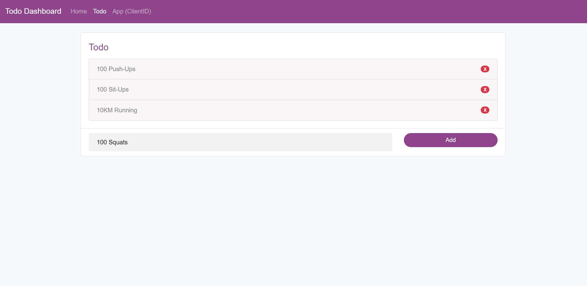

# Todo OAuth 2.0 Server

## Description

Implement OAuth 2.0 server for Todo App with ExpressJS

## Installation

```bash
yarn
```

## Structure

#### Todo OAuth Server Provider

**Stack :** Express, SQLite, ObjectionJS

Serve Api endpoint for Dashboard and Third party App client

#### Todo OAuth Dashboard

**Stack :** VueJS

Frontend manage Todo and Client App

#### Todo OAuth App

**Stack :** Express, EJS

Third party App

## Usage

Run 3 Repository :

- [todo-oauth-server-provider ( this repo )](https://github.com/duynghiavn/todo-oauth-server-provider)
- [todo-oauth-dashboard](https://github.com/duynghiavn/todo-oauth-dashboard)
- [todo-oauth-app](https://github.com/duynghiavn/todo-oauth-app)

Manage Todo for user and Client Key for Third party App at http://localhost:4001.



After create a Client App, put ClientID in app.ts of repo todo-oauth-app.

Give authorization permission for app at http://localhost:4002 to manage todo
